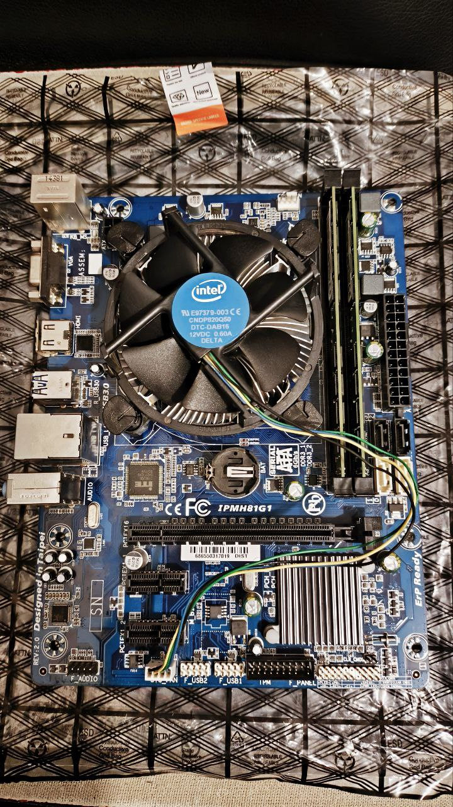
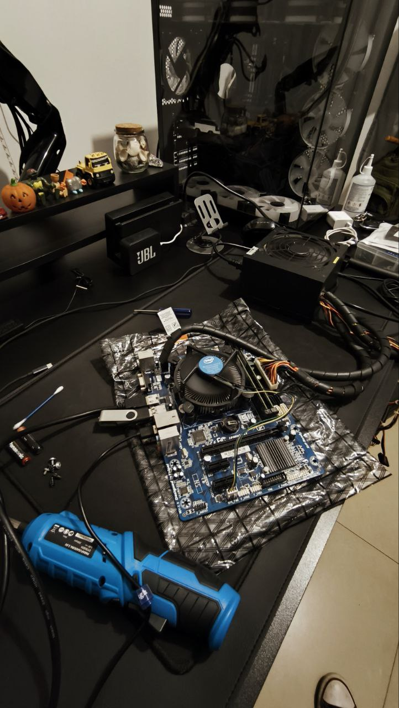
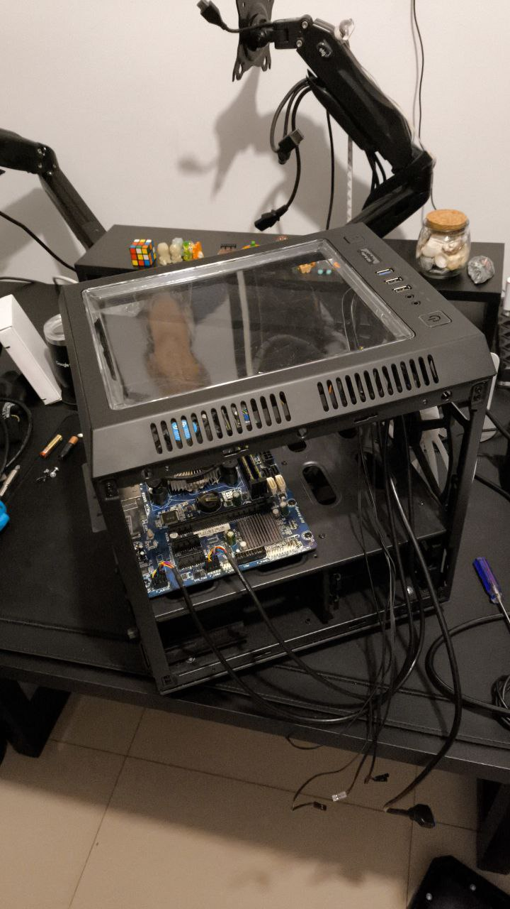
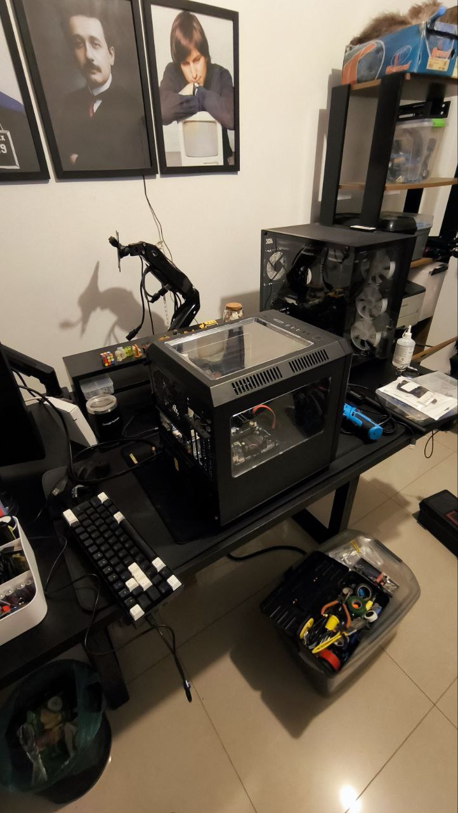

# 💻 Servidor Caseiro de Baixo Custo

Este projeto visa a construção de um servidor doméstico econômico, com orçamento de **R\$ 634,72**, utilizando a placa-mãe **IPMH81G1**. O objetivo é centralizar serviços de backup, sincronização de jogos, downloads via torrent e gerenciamento de containers Docker. O sistema contará com **dual boot** entre distribuições Linux e sistemas voltados para jogos, cada um instalado em discos rígidos separados.

## 📸 Imagens do Projeto

  
  
  
  

  

 

### Gastos com servidor caseiro

| Peça                                                        | Valor     | Plataforma |
|-------------------------------------------------------------|-----------|------------|
| Gabinete Gamer Microcraft III - CG-03RC                     | R$ 255,72 | OLX/MG     |
| Kit Placa mãe, Processador i5 4570, 16GB DDR3 e Fonte 500W  | R$ 379,00 | OLX/DF     |
| Placa Wi-fi 6 e Bluetooth 5.2  | R$ 124,33 | OLX/DF     |

Subtotal: R$ 759,05

 

## 🧰 Funcionalidades

1. **Servidor de Arquivos (Backup)**

2. **Sincronizador de Saves de Jogos via Syncthing**

3. **Download de Torrents e Arquivos**

4. **Controle de Casa Inteligente com rede Tuya e ESP32**

5. **Automações locais via N8N e Evolution API**

6. **Containers Docker**:    

| Nome                                                                                 | Descrição                                                           |
| ------------------------------------------------------------------------------------ | ------------------------------------------------------------------- |
|                | Plataforma de automação de fluxos de trabalho com interface visual. |
|          | Interface para integração de serviços e aplicativos diversos.       |
|        | Sistema operacional para gerenciamento de dispositivos domésticos.  |
|  | Ferramenta de monitoramento em tempo real de recursos do sistema.   |
|  | Painel de controle para gerenciamento de aplicações e serviços.     |
|  | Plataforma de automação residencial de código aberto.               |
|  | Interface para gerenciamento de containers Docker.                  |
|      | Aplicação de sincronização de arquivos P2P segura e descentralizada.|
|                          | Ferramenta para teste e monitoramento de velocidade de rede.        |
|                            | Gerenciamento de conexões proxy e VPN para segurança e privacidade. |
|    | Rede virtual privada para conectar dispositivos de forma segura.    |

  
7. **Dual Boot**:

   * **Xubuntu**: Sistema principal para execução dos serviços Docker mencionados acima.
   * **Batocera**: Distribuição Linux voltada para emulação de jogos antigos.
   * **Bazzite ou HoloISO**: Sistemas baseados no SteamOS para jogos modernos via Steam.

 

## 🪧 Especificações da Placa-Mãe IPMH81G1

| Componente               | Especificação                                       |
| ------------------------ | --------------------------------------------------- |
| **Socket**               | LGA 1150 (Intel Core 4ª Geração, Xeon E3 v3)        |
| **Chipset**              | Intel H81 Express                                   |
| **Fator de Forma**       | Micro-ATX                                           |
| **Memória RAM**          | 2x DDR3 DIMM até 16GB, 1333/1600 MHz                |
| **Vídeo Onboard**        | Intel HD Graphics (HDMI e VGA)                      |
| **Áudio Onboard**        | Realtek ALC662, 3 conexões (Line Out, Line In, Mic) |
| **Rede Onboard**         | Realtek RTL8111 - Gigabit Ethernet                  |
| **Portas SATA**          | 2x SATA 3.0 + 2x SATA 2.0                           |
| **Portas USB Traseiras** | 2x USB 3.0 + 4x USB 2.0                             |
| **Slots de Expansão**    | 1x PCIe x16, 2x PCIe x1                             |
| **Saídas de Vídeo**      | 1x HDMI + 1x VGA                                    |
| **PS/2**                 | 1x teclado + 1x mouse                               |
| **Painel Frontal**       | 2x USB 2.0, áudio, painel power/reset               |
| **M.2 NVMe**             | Não possui (só com adaptador PCIe)                  |
| **USB-C**                | Não possui (somente via adaptador PCIe)             |
| **BIOS**                 | AMI BIOS                                            |
| **Conexões de Energia**  | 24 pinos ATX + 4 pinos CPU                          |

## 💻 Especificações de Hardware

| Componente               | Especificação                                                         |
| ------------------------ | --------------------------------------------------------------------- |
| **Processador**          | Intel Core i5-4570, 4 núcleos, 4 threads, 3.2 GHz (turbo até 3.6 GHz) |
| **Memória RAM**          | 16 GB DDR3 1600 MHz                                                    |
| **Armazenamento**        | 1x SSD de 1TB (um para Xubuntu, outro para Batocera)                  |
| **Placa de Vídeo**       | Integrada Intel HD Graphics 4600                                      |
| **Fonte de Alimentação** | 500W Real                                                             |
| **Gabinete**             | Micro-ATX com ventilação frontal e traseira                           |

## 🔧 Opções de Upgrade

* **Placa-Mãe com Suporte a SSD M.2**:

  * [VEDO Placa Mãe LGA 1150 NGFF M.2 Slot](https://www.amazon.com.br/gp/product/B0BVVY1MSC/ref=ox_sc_act_title_1?smid=A2ZM0XEGQ4KBL7&th=1)

* **Processador Intel Core i7-4790**:

  | Especificação                 | i5-4570    | i7-4790                      |
  | ----------------------------- | ---------- | ---------------------------- |
  | **Cores/Threads**             | 4/4        | 4/8                          |
  | **Frequência Base**           | 3.2 GHz    | 3.6 GHz                      |
  | **Frequência Turbo**          | 3.6 GHz    | 4.0 GHz                      |
  | **Cache L3**                  | 6 MB       | 8 MB                         |
  | **TDP**                       | 84W        | 84W                          |
  | **Benchmark (UserBenchmark)** | 3.27       | 4.53                         |
  | **Desempenho Geral**          | Referência | +38.5% em relação ao i5-4570 |

*Fonte: [UserBenchmark](https://cpu.userbenchmark.com/Compare/Intel-Core-i7-4790-vs-Intel-Core-i5-4570/2293vs2770)*

---

Este projeto demonstra que é possível montar um servidor doméstico funcional e versátil com um investimento acessível, aproveitando componentes reutilizados e software de código aberto.
